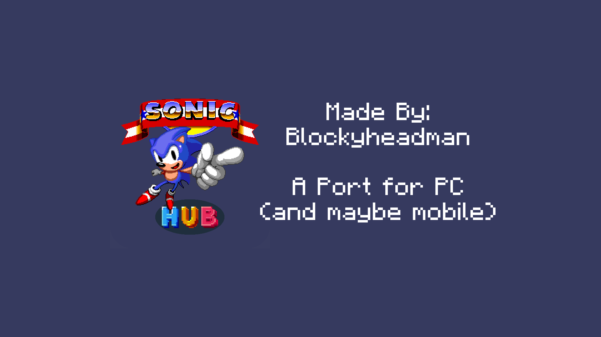

# Sonic Hub PC
Made By: Blockyheadman

## Welcome
Welcome to Sonic Hub PC!
Sonic Hub PC is a PC version of the online version of Sonic Hub made by Blockyheadman (me)
I'm deciding to make it on PC so it's gives a better experience for PC users! (and maybe even mobile!)

## Features
Currently there aren't many features due to the small amount of time it's been worked on. But I will be able to make more as I go on with this project.
For now, here's the list:
* Buttons that lead to online game links
* An alpha message
* Sound effects
* Music

Yeah.. It's not much but the more I work on it, the more it will have.

## My Goal
My goal with this project is to learn more about making UI with godot and making it functional. It's also to provide a better experience for PC users using Sonic Hub.

## Available Platforms
Currently the list of supported platforms is small but may increase over time:
* Windows
* Linux/X11
